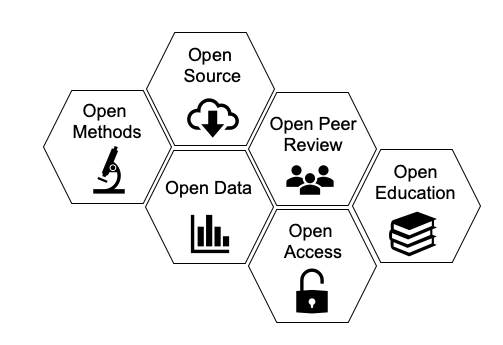

# Introduction to Open Science

!!! Info "Learning Objectives"
        After this lesson, learners should be able to:
        
        1.  Describe and discuss features of Open Science
        2.  Understand the structure of the FOSS workshop and final project
        3.  Describe the core platforms and capabailities of CyVerse and learn more about them

## What is Open Science?

Well, isn't this the million dollar question?

If you ask a dozen researchers, you will probably get just as many
answers. The concept of Open Science is changing and growing as
technology, expectations, and the reproducibility crisis change. What
constitutes Open Science can also be very different across domains,
based on both cultural expectations and more logistical limitations such
as data privacy. This means that Open Science isn't necessarily a set
of checkboxes you need to tick, but rather an holistic approach to doing
science.

To get a feel for how Open Science can be multifaceted and different for
each researcher, we will do a short breakout group session to discuss
what Open Science means to you.

!!! Question "Discussion Question"
        - What does Open Science mean to you?
        - What characteristics might a paper/project/lab require to qualify as "Open"?
        - What are some limitations to you, your lab/group, or your domain?

### Components of Open Science

One of the most fundamental, and certainly the most publicized component
of Open Science is the accessibility of data. This makes sense- without
access to your data, nothing else about your science can be all that
open. While we will devote an entire week of this course to data,
opening up your data is only one piece of the puzzle.

 

*Gallagher et al 2020, Nature Eco Evo*

This figure demonstrates the multiple intersecting pieces of Open
Science, which go beyond simply making data accessible. While we focus
primarily on Open Data, Open Source, and Open Methodology in FOSS, it's
worth considering how other parts of the scientific process might be
opened up more broadly.

Another component which sort of covers all of the pictured components,
or at least links a lot of them together, might be referred to as Open
Process. In response to the Reproducibility Crisis, many researchers,
particularly in fields like psychology, have begun to advocate for
**preregistration** of studies. This involves writing out and publishing
your entire research plan, from data collection to analysis and
publication, for the sake of avoiding practices like p-hacking or
HARKing. What preregistration also does is make the process of your work
more open, including many of the small decisions and tweaks you make to
a project that probably wouldn't make it into a manuscript. To learn
more about preregistration, you can check out the , a project that
provides a preregistration platform and other Open Science tools.

As mentioned above, it is worthwhile to think about Open Science not as
a set of checkboxes, but rather a holistic approach to doing science. In
that spirit, it can also be useful to think about Open Science as a
spectrum, from less to more open. While you might not achieve some
platonic ideal of openness for a variety of reasons, you can still make
great progress in moving your science towards the Open end of the
spectrum. In reality, a large scientific project probably consists of
multiple spectra; you can move your data towards the open end of the
spectrum while your software remains less open, and vice versa. All this
is to say that doing Open Science is not a static set of goals you must
achieve, it is a process that grows and changes with your science
itself.

One of the biggest challenges of doing science is that you might have to
wear many different hats: domain expert, lab manager, statistician,
teacher, mentor, grant writer, manuscript author, public speaker... the
list goes on. Doing Open Science is no different, but the list of skills
may be even greater, since the goal is now to openly communicate each
step of the process to a broader audience. This also makes teaching Open
Science quite challenging- we will cover topics ranging from "soft
skills" like project management and internal communications to more
technical skills like software management and containers. We could
probably teach this whole workshop on each single topic, but we clearly
don't have the time to do that. Instead, we will focus on a
higher-level look at the landscape of Open Science and introduce you to
a wide variety of skills and concepts with the idea that you can go on
to find ways to implement them in your own work.

---
