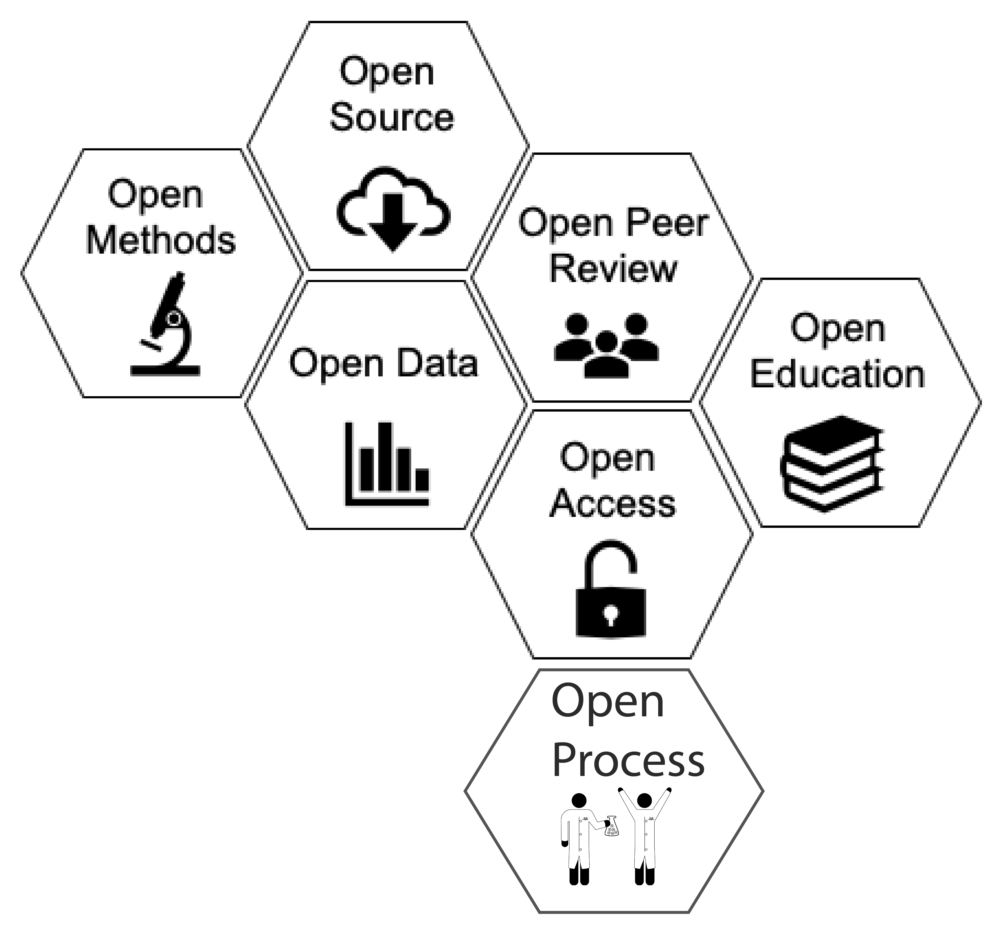

# Introduction to Open Science

!!! Info "Learning Objectives"
        After this lesson, learners should be able to:
        
        1.  Describe and discuss features of Open Science
        2.  Understand the structure of the FOSS workshop and final project
        3.  Describe the core platforms and capabailities of CyVerse and learn more about them

## What is Open Science?

Open Science isn't necessarily a set of checkboxes you need to tick, but rather an holistic approach to doing
science. Open Science can be very different across domains, based on both cultural expectations and logistical limitations such
as data privacy. In the context of research, open science helps to balance between getting it right over getting it published.

*What is the open science to you?*

### Components of Open Science

The most fundamental component of Open Science is the accessibility of data. Without that, everything else falls apart. 

The diagram represents core pieces of Open Science beyond making data accessible. We will focus on Open Data, Open Source, and Open Methodology.
One component that was added additionally to the chart is Open Process. It links a lot of Open Science pieces together. It was created in response to the Reproducibility Crisis when researchers have begun to advocate for **preregistration** of studies ([Learn More abour Preregistration](https://www.cos.io/initiatives/prereg#:~:text=What%20is%20Preregistration%3F,Both%20are%20important.)). This involes writing out and publishing the entire research plan to avoid practices like [p-hacking](https://embassy.science/wiki/Theme:6b584d4e-2c9d-4e27-b370-5fbdb983ab46#:~:text=P%2Dvalue%20hacking%2C%20also%20known,there%20is%20no%20underlying%20effect.) or [HARKing](https://pubmed.ncbi.nlm.nih.gov/15647155/). Preregistration separates hypothesis-generating  (exploratory) from hypothesis-testing (confirmatory) research. Both are important. But the same data cannot be used to generate and test a hypothesis.

Another component which sort of covers all of the pictured components,
or at least links a lot of them together, might be referred to as Open
Process. In response to the Reproducibility Crisis, many researchers,
particularly in fields like psychology, have begun to advocate for
**preregistration** of studies. This involves writing out and publishing
your entire research plan, from data collection to analysis and
publication, for the sake of avoiding practices like p-hacking or
HARKing. What preregistration also does is make the process of your work
more open, including many of the small decisions and tweaks you make to
a project that probably wouldn't make it into a manuscript. To learn
more about preregistration, you can check out the , a project that
provides a preregistration platform and other Open Science tools.

As mentioned above, it is worthwhile to think about Open Science not as
a set of checkboxes, but rather a holistic approach to doing science. In
that spirit, it can also be useful to think about Open Science as a
spectrum, from less to more open. While you might not achieve some
platonic ideal of openness for a variety of reasons, you can still make
great progress in moving your science towards the Open end of the
spectrum. In reality, a large scientific project probably consists of
multiple spectra; you can move your data towards the open end of the
spectrum while your software remains less open, and vice versa. All this
is to say that doing Open Science is not a static set of goals you must
achieve, it is a process that grows and changes with your science
itself.

One of the biggest challenges of doing science is that you might have to
wear many different hats: domain expert, lab manager, statistician,
teacher, mentor, grant writer, manuscript author, public speaker... the
list goes on. Doing Open Science is no different, but the list of skills
may be even greater, since the goal is now to openly communicate each
step of the process to a broader audience. This also makes teaching Open
Science quite challenging- we will cover topics ranging from "soft
skills" like project management and internal communications to more
technical skills like software management and containers. We could
probably teach this whole workshop on each single topic, but we clearly
don't have the time to do that. Instead, we will focus on a
higher-level look at the landscape of Open Science and introduce you to
a wide variety of skills and concepts with the idea that you can go on
to find ways to implement them in your own work.

---
